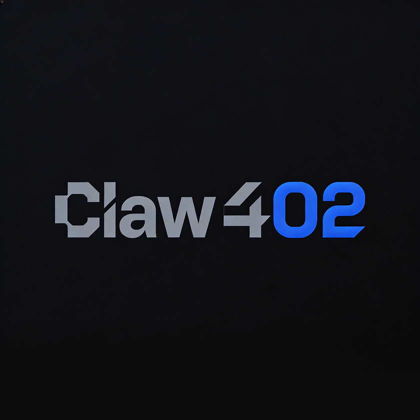
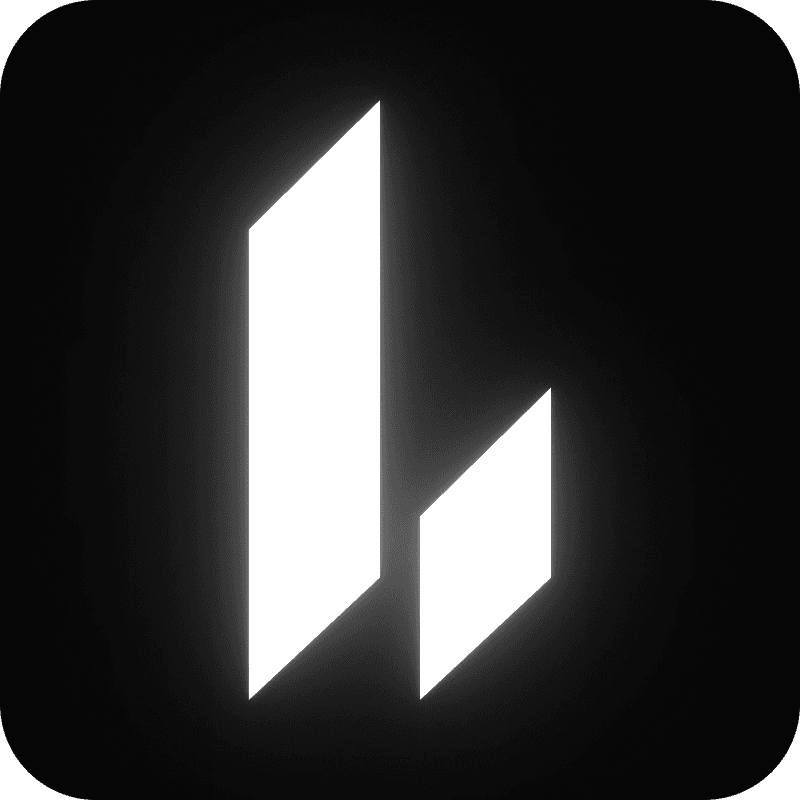

names rewritten to vl on 2026-09-30 (VL rename)
<h1 align="center">VL Intelligent</h1>

<p align="center">
  <strong>あなた専属の AI トレーディングアシスタント。</strong><br/>
  <strong>あらゆる市場。あらゆるモデル。API キー不要、USDC で支払い。</strong>
</p>

<p align="center">
</p>

<p align="center">
  <a href="https://golang.org/"></a>
  <a href="https://reactjs.org/"></a>
  <a href="https://x402.org"></a>
  <a href="https://claw402.ai"></a>
</p>

<p align="center">
  <a href="../../../README.md">English</a> ·
  <a href="../zh-CN/README.md">中文</a> ·
  <a href="README.md">日本語</a> ·
  <a href="../ko/README.md">한국어</a> ·
  <a href="../ru/README.md">Русский</a> ·
  <a href="../uk/README.md">Українська</a> ·
  <a href="../vi/README.md">Tiếng Việt</a>
</p>

---

VL Intelligent はオープンソースの**自律型** AI トレーディングアシスタントです。従来の AI ツールのように手動でモデルを設定し、API キーを管理し、データソースを接続する必要はありません — VL Intelligent の AI は**市場を自ら認識し、モデルを自ら選択し、データを自ら取得します**。人間の介入はゼロ。あなたは戦略を設定するだけ、残りは AI が処理します。

**完全自律**: AI がどのモデルを使うか、どの市場データを取得するか、いつ取引するかを自ら判断します。手動のモデル設定不要。複数サービスの API キー管理不要。USDC ウォレットに入金して実行するだけ。

他との違い：**[x402](https://x402.org) マイクロペイメント内蔵**。API キー不要。USDC ウォレットに入金してリクエストごとに支払い。ウォレットがあなたの身分証明。

**http://127.0.0.1:3000** を開く。完了。

---

## クイックデモ

<p align="center">
  <a href="https://drive.google.com/file/d/1frzw-HDZ3viQvLOQKsAJGc9bT0dXs68D/view">
    
  </a>
</p>

<p align="center">
  カバー画像をクリックするとデモ動画を視聴できます。
</p>

---

## x402 の仕組み

従来のフロー：アカウント登録 → クレジット購入 → API キー取得 → クォータ管理 → キーのローテーション。

x402 フロー：

```
リクエスト → 402（価格提示）→ ウォレットが USDC を署名 → リトライ → 完了
```

アカウント不要。API キー不要。前払いクレジット不要。ウォレット1つで全モデル。

### 内蔵 x402 プロバイダー

| プロバイダー | チェーン | モデル |
|  **[Claw402](https://claw402.ai)** | Base | GPT-5.4, Claude Opus, DeepSeek, Qwen, Grok, Gemini, Kimi — 15+ モデル |

---

## 機能

| 機能 | 説明 |
| **マルチ AI** | DeepSeek, Qwen, GPT, Claude, Gemini, Grok, Kimi, MiniMax — いつでも切替 |
| **マルチ取引所** | Binance, Bybit, OKX, Bitget, KuCoin, Gate, Hyperliquid, Aster, Lighter |
| **ストラテジースタジオ** | ビジュアルビルダー — コインソース、インジケーター、リスク管理 |
| **AI ディベートアリーナ** | 複数 AI が取引を議論（ブル vs ベア vs アナリスト）、投票、実行 |
| **AI 競争** | AI がリアルタイムで競争、リーダーボードで成績ランキング |
| **Telegram エージェント** | トレーディングアシスタントとチャット — ストリーミング、ツール呼び出し、メモリ |
| **バックテストラボ** | 過去データシミュレーション、エクイティカーブと成績指標 |
| **ダッシュボード** | ライブポジション、損益、Chain of Thought 付き AI 判断ログ |

### 市場

暗号通貨 · 米国株 · FX · 貴金属

### 取引所 (CEX)

| 取引所 | ステータス | 登録 (手数料割引) |
|  **Binance** | ✅ | [登録](https://www.binance.com/join?) |
|  **Bybit** | ✅ | [登録](https://partner.bybit.com/b/83856) |
|  **OKX** | ✅ | [登録](https://www.okx.com/join/1865360) |
|  **Bitget** | ✅ | [登録](https://www.bitget.com/referral/register?from=referral&clacCode=c8a43172) |
|  **KuCoin** | ✅ | [登録](https://www.kucoin.com/r/broker/CXEV7XKK) |
|  **Gate** | ✅ | [登録](https://www.gatenode.xyz/share/VQBGUAxY) |

### 取引所 (Perp-DEX)

| 取引所 | ステータス | 登録 (手数料割引) |
|  **Hyperliquid** | ✅ | [登録](https://app.hyperliquid.xyz/join/AITRADING) |
|  **Aster DEX** | ✅ | [登録](https://www.asterdex.com/en/referral/fdfc0e) |
|  **Lighter** | ✅ | [登録](https://app.lighter.xyz/?referral=68151432) |

### AI モデル (API キーモード)

| AI モデル | ステータス | API キー取得 |
|  **DeepSeek** | ✅ | [API キー取得](https://platform.deepseek.com) |
|  **Qwen** | ✅ | [API キー取得](https://dashscope.console.aliyun.com) |
|  **OpenAI (GPT)** | ✅ | [API キー取得](https://platform.openai.com) |
|  **Claude** | ✅ | [API キー取得](https://console.anthropic.com) |
|  **Gemini** | ✅ | [API キー取得](https://aistudio.google.com) |
|  **Grok** | ✅ | [API キー取得](https://console.x.ai) |
|  **Kimi** | ✅ | [API キー取得](https://platform.moonshot.cn) |
|  **MiniMax** | ✅ | [API キー取得](https://platform.minimaxi.com) |

### AI モデル (x402 モード — API キー不要)

15+ モデルを [Claw402](https://claw402.ai) 経由で利用 — USDC ウォレットのみ

---

## インストール

### ソースから

```bash
# 前提条件: Go 1.21+, Node.js 18+, TA-Lib
# macOS: brew install ta-lib

go build -o vl-bin && ./vl-bin          # バックエンド
cd web && npm install && npm run dev  # フロントエンド（新しいターミナル）
```

---

> **リスク警告**: AI 自動取引には重大なリスクがあります。学習/研究目的または少額でのテストのみを推奨します。

---

## License

[AGPL-3.0](../../../LICENSE)

