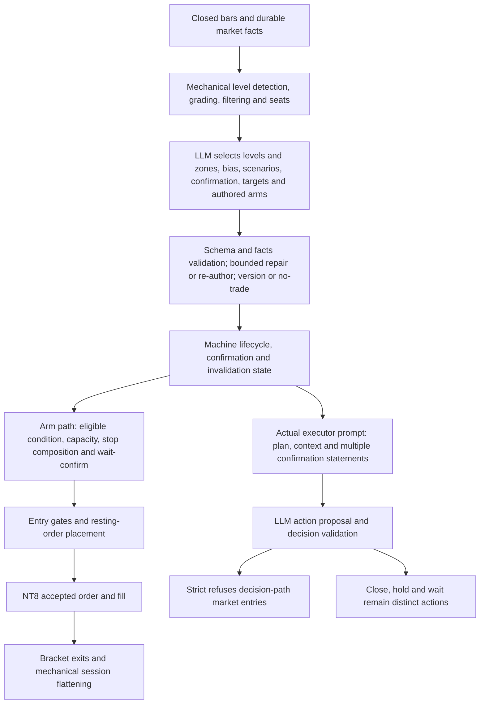

# Section 3 — Decisions: complete trading-method assessment

Owner: hoang · 2026-09-05 · Section 3 only · `docs/vet-03-0905-complete` · documentation only.

## One-page summary

**My verdict:** I would permit an LLM to propose a conditional trading plan, but give the machine final authority over whether that plan is executable and how much it risks. The present system partly does this. Its remaining problem is that a level, a narrative setup, a machine confirmation and an executable order are still presented as if they were the same decision. They are not interchangeable. Neither the planner's edge nor the profitability of strict enforcement is established. [I: analytical judgment, untested here; T: evidence below]

The corrected book contains **58 trades, −$466.428572, 18 wins / 38 losses / 2 flats across 12 CME days**. Excluding flats, wins are **18/56 = 32.1%, Wilson 95% [21.4%,45.2%]**. The 47 decision-path trades lost **$560.928572 across nine days**. There are **no realized trades entered after the September 3 11:10:33 CT enforced-strict boot**. Historical losses cannot measure the performance of a policy that had not yet governed those trades. [T; `complete/population58.csv:2`, `complete/subset47_coverage.csv:2`]

**Three biggest problems**

1. **The plan and executable contract diverge.** The planner is offered an immediate continuation entry on the AI path while strict closes that path; the actual executor prompt still offers market entries. A saved prompt says both S1 confirmation MET and S1 NOT MET, without one final eligibility verdict. [Source; Q1–Q2]
2. **Geometry has divided authority.** The planner chooses entry/stop/target, the stop composer can widen the stop, and gates reassess feasibility. Twenty later placement records in one September 4 NY S2 family (21 including initial arm38; footnote in Q4), with no fills, are operational evidence of this interaction—not twenty failed trading ideas. Authoring-time R:R alone cannot resolve subsequent changes. [T; Q2/Q4]
3. **The prior report overstated what its statistics measured.** A touched reference was called a fired trigger; persisted lifecycle versions were called successful LLM attempts; censored position MFE was used to choose targets; and repeated refusals were credited with money saved. I withdraw those conclusions. [Q2/Q4 and supersession table]

**Three biggest opportunities**

1. **One explicit authority chain:** machine level facts → LLM hypothesis/selected zone → machine scenario state → feasible, tick-valid ticket → final risk checks → broker acknowledgment. Preserve contextual judgment while making monetary authority mechanical. [I]
2. **Make abstention and conditional readiness legitimate outputs.** The planner may describe a future continuation without pretending displacement already occurred, and may conclude that neither direction has an executable trade. No forced long/short balance or forced bias-side arm. [I]
3. **Review the executable plan before the session.** Show the actual risk, next obstacle, expiry, readiness and allowed actions; let the owner approve, veto or request one bounded re-read. Record that decision for a later matched review. Existing approval UI needs arm-path and version scope before it would implement this proposal. [I; Q5]

## Evidence basis and corrections that govern every answer

I use first person for analytical judgments, not for a fictional professional biography. **[T]** means a measured local observation, with its population; **[R]** means a named primary research source with scope; **[I]** means my analytical judgment, untested here. Source-code behavior is labeled **Source**, not trading evidence. A deterministic rule is reproducible; that does not make its economic premise proven.

I read the entire original dispatch at `/mnt/c/Users/hoang/.codex/attachments/bd5ae830-117e-4e07-a35a-5ba7d02f5b82/pasted-text.txt` and the previous Section 3 report. My fresh worktree starts at **`488ce82748ca570804240630677c90d3055f128e`**, current `origin/dev` at creation, which had merged that report after `b4376246`. This report supersedes the previous Section 3 prose and its recommendations in full. Section 2 retains detailed level-grading ownership, Section 7 the full prompt rewrite, and Section 9 integration.

`D` below means `docs/superpowers/reports/2026-09-05-vet-03-decisions-data/complete/`. Every row-level output and both reproduction scripts are there. `D/source_evidence.txt:1` preserves original `path:line` references; `D/log_evidence.txt:1` preserves selected historical log lines. No production module was imported or executed. SQLite was opened with `mode=ro`, `PRAGMA query_only=ON`, and read transactions. No JWT helper was used. The unauthenticated `/api/health` returned HTTP 200 and revision `36648655cfe0`; this is **running revision**, not the docs branch. Leg D on dev therefore must not be described as historically enforced by that binary.

The primary query is:

```sql
SELECT * FROM trader_positions
WHERE entry_time >= 1786770000000
  AND source <> 'e7_farside_test'
  AND plan_id <> 'UNRESOLVABLE'
  AND pnl_corrected IS NOT NULL
ORDER BY id;
```

The raw era has 71 rows. Remove the union of test IDs **572,573,574**, null-corrected non-test IDs **576,577,579**, and non-test sentinel IDs **530,539,545,546,566,571,580**: 13 unique exclusions, leaving 58. IDs 573/574 also carry the sentinel; 572 also has null corrected P&L. Do not add overlapping exclusions twice. The 58 exact IDs are in `D/population58.csv:2`, and grouped membership is in `D/summary.json:1`. Only `pnl_corrected` enters performance arithmetic. I do not infer commission treatment beyond that column's definition.

| Mutually exclusive source population | n | Corrected dollars | W/L/flat | Non-flat wins, Wilson 95% |
|---|---:|---:|---|---|
| `system` decision path | 47 | −560.928572 | 12/33/2 | 12/45, 26.7% [16.0%,41.0%] |
| `reconcile`, armed-fill lineage | 9 | +42.50 | 5/4/0 | 5/9, 55.6% [26.7%,81.1%] |
| `armed_entry`, IDs 582/585 | 2 | +52.00 | 1/1/0 | 1/2, 50.0% [9.5%,90.5%] |
| **Primary total** | **58** | **−466.428572** | **18/38/2** | **18/56, 32.1% [21.4%,45.2%]** |

The corresponding all-trade win fraction is 18/58, **31.0% [20.6%,43.8%]**; that denominator includes flats. Mean corrected P&L is **−$8.041872 per trade**, observed winner/loser payoff **1.749750**. I do not compare that payoff directly to a planned ticket R:R. CME days use America/Chicago with a **17:00 boundary**, not calendar dates or 58 independent experiments. Wilson intervals here describe binary proportions; correlated trades, plan versions and retries do not become independent evidence because an interval is printed. I make no condition/session promotion ruling from cells below 30 observations, and 30 is not sufficient proof by itself.

## 1. Division of labor: actual chain, and how I would draw it

**Actual source chain at this branch**



This is a split execution architecture, not a serial planner→executor→broker pipeline. Under strict, an eligible arm can execute without the executor LLM's permission; an executor market-entry proposal cannot create a trade merely by citing a valid scenario. `trader/entry_gate.go:184`, `trader/armed_executor.go:383`, `kernel/engine_prompt_futures.go:245`. **Source.**

| Decision link | Actual authority and mechanical boundary | Trading assessment |
|---|---|---|
| Level facts, grading and filter | `kernel/levels_assemble.go:150` begins from closed bars, gathers detectors and deduplicates; `kernel/levels_score.go:420` filters by proximity; `:443` counts distinct confluence families; `:475` applies HTF/scoring terms; `:601` runs grade filtering/seating. | A grade organizes attention. It is not a probability of holding. Detailed term calibration belongs to Section 2. [I] |
| Level → setup zone | Planner receives ranked levels but selects roles and scenarios; rules at `kernel/planner_prompt.go:704` and provenance validation at `trader/auto_trader_planner.go:1648`. Stored plan rowid **253** uses Supply·1h 29657.38 as a fade zone and VWAP 29591.02 as a reclaim reference (`D/plan_row253.json:1`). | A price can be an entry, an obstacle or an invalidation anchor. Give each selected zone an explicit role and formation/as-of time; a strong level is not automatically a good fade. [I] |
| Zone → scenario | LLM writes condition, direction, trigger, invalidation, quality, target chain and optional arm. Entry-law vocabulary is constrained by `kernel/entry_law.go:38`. | Let it choose a coherent conditional hypothesis and say what observation would disprove it. Do not require an immediate trade merely because a level is seated. [I] |
| Scenario → readiness | `kernel/plan_confirm.go:49` evaluates touch/close/MSS/time-hold; `:189` handles ordered compound confirmation; invalidation is separately enforced on the arm path at `trader/entry_gate.go:229`. | “Reference touched,” “confirmation completed,” “still valid,” and “order permitted” need separate labels, followed by one final eligibility verdict. [I] |
| Readiness → entry | Condition determines limit versus stop-entry (`kernel/planner_prompt.go:732`); capacity checks at `trader/armed_executor.go:320`; shadow checks at `:335`; wait-confirm before arm feasibility at `:426`. | A limit fade buys/sells a location; a confirmation entry pays for additional information. They are different opportunity sets. Do not judge one from the other’s fill rate. [I] |
| Entry → target | Planner owns `target_chain` and arm target; executor is expressly allowed to choose its own `take_profit` (`kernel/planner_prompt.go:722`; actual saved prompt discussed below). | Evaluate distance to the first opposing structure, subsequent target, and remaining session time. A target is a proposed payoff, not evidence of achievable reward. [I] |
| Entry → stop | `composeArmStop` takes the widest of authored stop, structural anchor plus clearance, and ATR floor (`trader/arm_stop_anchor.go:20`, `:71`; called at `trader/armed_executor.go:390`). | Mechanical composition gives consistent enforcement. It does not establish that the nearest level or 1.5×ATR is the economic invalidation of this setup. Preserve the thesis-invalidation anchor separately. [I] |
| Ticket → allowed action | Shared gate order is D→0→1→2→3→4→5→6→7→no-chase warning (`trader/entry_gate.go:157`). Actual executor enum still includes open, close, hold and wait. | Hard loss/capacity/geometry boundaries belong to the machine. Changing the enum or narrative must not weaken those boundaries. [I] |
| Fill → management | Broker acknowledgment and fill establish what actually traded. Mutable arm fields are not immutable initial risk. Existing close/hold behavior must be accounted for before changing executor cadence. | Preserve initial accepted bracket and fill event identity. Do not optimize exits from outcome-conditioned MAE alone. [I] |

### The actual executor prompt, not a reconstructed ideal

Decision **37304**, September 3 **20:35:06 CT**, stores the prompt actually used, reproduced in `D/executor_37304_system.txt`. Its result is in `D/executor_37304_result.json:1`.

- At **line 98**, the action enum includes `open_long`, `open_short`, `close_long`, `close_short`, `hold`, `wait`.
- At **line 104**, it says: “Plan target chains are guidance — YOU set take_profit (D2 ruling); the R:R gate is the only TP constraint.”
- At **line 152**, S1's two-leg confirmation is reported **overall MET**.
- At **line 156**, it separately reports **“confirm S1 NOT MET”**, referring to a currently forming touch shape.
- The model proposed a short; the saved execution result refused it under strict. Decision **37322** repeats the same authority mismatch (`D/executor_37322_system.txt:152`, `:156`).

These two confirmation statements concern different scopes: historical structured confirmation versus a current touch episode. I do not assert that their underlying evaluators mathematically disagree. The actionable defect is that the prompt gives a junior trader two incompatible-looking instructions under the same word, without a clearly authoritative final state. Nor does generic “Entry Standards (Strict)” mean `plan_mode=strict`; the latter is enforced by Go. **Source + T, two documented examples; causal effect on the proposals unmeasured.**

**Section 7 cross-check (integrated commit `f8401ceb`, §2.5 and Appendix B):** its actual executor read **37768** lacks authored `arm.entry/stop/target`, authoritative working-order status, effective strict permissions and the hold-lock permission state. I accept that field map and leave the 28-item instruction appendix and full rewrite to Section 7. Close actions are not unconditionally executable: `trader/auto_trader_orders.go:77` can suppress discretionary LLM closes under hold lock, while safety exits remain separate (`trader/exit_mechs_suspend.go:33`). My proposed final eligibility/permission contract therefore covers position management as well as entries; removing `open_*` words alone would be incomplete.

The 13 market-entry proposals after the enforced-strict boundary were all refused: **13/13, 100% [77.2%,100%]**, exact decision IDs **37304,37305,37306,37307,37308,37310,37311,37313,37315,37318,37319,37320,37322**. They are repeated proposals, not 13 independent trading opportunities. `D/decision_gate_events.csv:8`. I withdraw “executor has no output”: entry is closed, but close/hold/wait and review responsibilities still exist. Section 7 should align the actual prompt/action contract; I do not rewrite its prompt here.

### Would I draw it this way?

**Partly.** I retain planning, mechanical risk enforcement and an independent broker record. I would replace divided ticket ownership with this proposed flow [I; not applied]:

```text
Frozen, timestamped market facts and formed levels
  → LLM selects a zone and conditional hypothesis, or abstains
  → machine returns supported / waiting / invalid / shadow / unavailable
  → machine compiles tick-valid entry, structural stop, candidate target and dollar risk
  → owner reviews the version before the session
  → placement-time risk and R:R revalidation on current executable inputs
  → broker acknowledgment / fill → immutable initial-risk record
  → mechanical exits plus explicitly authorized executor management/review
```

An authoring check can reject impossible geometry early. It cannot guarantee future feasibility. Before placement, revalidate price, stop floor, target availability, capacity, clock and loss limit. During a resting order's lifetime, a material invalidation must still cancel it. Once a fill occurs, recompute **realized entry risk/R:R for monitoring** and use an owner-approved fill-breach policy; one cannot retroactively reject an executed fill. I do not recommend widening targets or loosening risk to make a ratio pass.

## 2. May the LLM author plans? What, and with what measured results?

**Yes, as a constrained author.** I would let it select among timestamped eligible levels, identify a setup zone, choose a conditional side, explain the thesis and invalidation, rank plausible structural targets, identify contextual uncertainty, and abstain. I would not let it manufacture a level, change lot size, decide the dollar-loss ceiling, invent missing market facts or override an invalid/unsupported condition. The machine must own order type, tick rounding, condition-state evaluation, risk arithmetic, position capacity and final permission. [I]

I would not reduce every plan to one scenario on the strength of S1's historical result. A primary and alternative can be useful if they represent mutually exclusive observations; several repeated paraphrases of the same trade cannot. The rule should be distinct hypotheses with explicit transition/expiry conditions, not a quota of bullish and bearish ideas. [I]

### 2a. Last seven days: rejection by rule

Window is **August 29 00:00 CT inclusive to September 5 00:00 CT exclusive**. The database contains **94 persisted session-plan versions** in that window, including **14 `planner_fail_closed`**, copied dormant/rearmed versions and two incident-kill versions. There are **64 persisted rejection rows**, IDs **69–132**, first recorded September 1 11:59:57 CT. No logged rejection rows before that timestamp does not prove no rejects occurred.

**Cross-report denominator footnote (Section7:95 versus Section3:94):** the same seven-day creation-time window contains **95 persisted versions across all session types**. My intraday filter excludes exactly **`plans.rowid=223`**, `(plan_id=2026-08-31:WEEKLY:8d5c8af5_8ef641a7-815c-4bb5-9798-b070b67d7998_deepseek_1781246265, version=1)`, `session=WEEKLY`, `trigger_reason=weekly_boot_backfill`, created **2026-09-03 00:06:24.297190952 UTC = September2 19:06:24 CT**. Thus **95−1=94**, with no discrepancy in the underlying query window. `D/summary.json` records the complete excluded row. Neither count is an LLM-attempt denominator. `D/plans_last7.csv:2`, `D/rejects_last7.csv:2`.

| Recorded reason family | Exact reject IDs | n/64; share, Wilson 95% |
|---|---|---|
| Continuation void after close-back | 73,74,75,77,83,88,92,94,96,98,100,101,102,103,105,107,108,109,110,111,113 | 21/64; 32.8% [22.6%,45.0%] |
| Continuation zero displacement | 114,115,117,126,129,132 | 6/64; 9.4% [4.4%,19.0%] |
| Continuation missing required close | 119,121,124,127,130 | 5/64; 7.8% [3.4%,17.0%] |
| Confirmation vocabulary | 70,78,79,81,82,112,118 | 7/64; 10.9% [5.4%,20.9%] |
| Fade requires touch | 76,93,99,104,106 | 5/64; 7.8% [3.4%,17.0%] |
| Arm requires pullback mode | 120,122,125,128,131 | 5/64; 7.8% [3.4%,17.0%] |
| Arm-leg contract | 69,80,84,85,86 | 5/64; 7.8% [3.4%,17.0%] |
| Transport, not a trading-rule refusal | 71,72,87,89,90,91 | 6/64; 9.4% [4.4%,19.0%] |
| Gap-up constraint | 116,123 | 2/64; 3.1% [0.9%,10.7%] |
| Level cap | 97 | 1/64; 1.6% [0.3%,8.3%] |
| Retest distance | 95 | 1/64; 1.6% [0.3%,8.3%] |

These are **shares of recorded rejects**, not rejection probabilities per attempt or per opportunity. The three precise continuation families total **32/64, 50.0% [38.1%,61.9%]**. A rejection merely mentioning `breakdown_continue` is not automatically a continuation-facts failure.

**True seven-day rejection rate by rule per LLM attempt: UNMEASURABLE from these tables.** Missing: an exhaustive attempt ledger with read UUID, attempt UUID, call start/end, success/validator/provider outcome and emitted plan version. `plans` contains synthetic lifecycle rows, and `trader/auto_trader_planner.go:1548` explicitly avoids inserting provider failures into the rejected-prompt table in the newer path. Thus neither the old **64/(64+79)=44.8%** nor a new **64/(64+94)** is a valid authoring-attempt rejection rate. I will not relabel an unavailable denominator to claim completion.

### 2b. Re-author cost in seconds, and legal repair loops

I replaced arbitrary 20-minute clustering with a transparent **attempt-sequence association**: same trader/trade-date/session; a repeated or decreasing attempt number starts a new sequence. For each sequence, the next qualifying persisted plan before the next reject sequence is a possible endpoint, never an asserted read-ID join. This yields **31 sequences; 22 have a possible next-plan endpoint and nine do not**. For those 22 associations, first reject→next plan is **median 298.706 seconds, range 27.053–2131.077 seconds**; six endpoints are fail-closed records, not successful repairs. Exact reject IDs, endpoint rowids and seconds appear in `D/reauthor_episodes.csv:2`.

**True mean/p50/p90 incremental model re-author latency: UNMEASURABLE** without the per-read/attempt start-end identity above. The associations include waiting, possible later wakes and failure endpoints. I withdraw the previous “median 286s” as a measurement of actual re-author cost.

A narrower worked read is measurable. September 4 NY: read evidence at **08:00:38**, first rejection **08:07:20** (ID118), second **08:09:03** (ID119), third/fail-closed **08:11:45** (ID120, plan rowid251). Wall-clock read→fail-closed is **667s**; first rejection→fail-closed is **265s** at the log's second precision. `D/log_evidence.txt:6` onward preserves the original log locations. That is time consumed without a usable plan, not the time to a successful plan.

This example exposes a trading-contract problem. A continuation needs the relevant confirming displacement; a validator suggests immediate mode when that future event has not occurred; the next output adds an arm to immediate mode; the arm contract refuses it. Even an unarmed immediate scenario cannot enter through the executor under strict. The documented rules at `kernel/planner_prompt.go:728`, `:733`, `:752`, and `trader/entry_gate.go:184` cannot be understood as a promise that every authored mode has an executable path.

There already is a bounded repair mechanism: **three attempts total**, prior errors carried forward, compact repair where applicable, cumulative corrections for re-author, identical resend for a transport failure (`trader/auto_trader_planner.go:1491`). I do not propose building that again. I propose giving the model a machine-generated legal-action menu for the current mode and distinguishing **latent hypothesis** from **eligible order**. If displacement is absent, a conditional hypothesis can wait; it may not claim the condition happened. If no legal ticket exists, the result is no trade. Repair must fix a schema/provenance error, not mutate risk, targets or directional beliefs until any ticket passes. [I]

### 2c. Share whose trigger ever fired: identity, formation and no-peek limits

**Full live scenario-trigger share: UNMEASURABLE here.** A valid evaluation needs, for every opportunity, the plan available at that instant, level formation time, ordered confirmations, invalidation/expiry, applicable rule parameters, session permissions and market data actually received then. Stored bars can be backfilled; a final chart is not proof the bot saw it live. `trade_excursions` has **zero rows**, `plan_lifecycle_log` is sparse, and the snapshot does not contain a complete event-time state trace. The original price-touch proxy cannot substitute for this chain.

I nevertheless deliver a reproducible **forward price-reachability component**, clearly separate from a full trigger. For the last-seven-day version corpus:

- Identity is `(plan_id, version, scenario id, scenario index)` plus a recorded material-document hash. Never deduplicate by `S1` alone. Each version retains its own availability window; identical-looking prices on different days do not merge.
- Windows start at the later of plan creation and actual session start; end at the next version or session flat: **ASIA 17:00–02:00, LONDON 02:00–08:30, NY 08:30–14:45 CT**, from `kernel/session_registry.go:83`.
- Only active versions enter the observable denominator. I require a bar to open after plan availability and close by window end. Birth-minute ranges are excluded, preventing a price touched before authoring from being credited after it.
- Exact rows, hashes, window endpoints, expected/available bar counts and first-touch bar keys are in `D/scenario_windows_last7.csv:2`. These are authored-specification exposures, **not statistically independent market opportunities**; a stable cross-version market-opportunity/formation ID remains missing.

There are **261 version-scenarios**, of which **55 are inactive** and **three active rows have incomplete bar coverage and no observed touch**. The other **203** have a complete one-minute grid: **79/203 references reached, 38.9% [32.5%,45.8%]**. Among the **96** complete-grid single `touch` confirmations without a second leg or breakdown object, the confirmation component is **36/96, 37.5% [28.5%,47.5%]**. Even this component is not a complete trade trigger: it does not establish the setup remained valid or executable. The 206 active specification hashes are distinct within plan ID under the conservative signature; that does not establish economic independence across re-authoring.

| Condition | Reference reached / complete-grid version exposures | Wilson 95% | Meaning |
|---|---:|---|---|
| reject | 30/84, 35.7% | [26.3%,46.4%] | Price location only |
| sweep_reclaim | 18/62, 29.0% | [19.2%,41.3%] | Sweep/ref touch does not prove reclaim |
| reclaim | 14/27, 51.9% | [34.0%,69.3%] | Touch does not prove confirming close/MSS |
| breakout_retest | 13/24, 54.2% | [35.1%,72.1%] | Not live eligibility; shadow policy separate |
| hold | 2/3, 66.7% | [20.8%,93.9%] | Not a time-hold test |
| breakdown_continue | 1/2, 50.0% | [9.5%,90.5%] | Not displacement/retest validation |
| acceptance | 1/1, 100% | [20.7%,100%] | Not acceptance validation |

I withdraw “the whole-session versus in-force gap proves churn caused missed opportunities.” Those old figures used different populations, included inappropriate session boundaries and did not replay the true trigger. Frequent version changes can be useful if new information invalidates a hypothesis. To call them harmful, I would need paired, no-peek replay of unchanged versus revised hypotheses under the same feed, risk and one-position rule. [I]

### 2d. The 47-trade subset: complete attribution, limited risk inference

Every one of the **47 `source=system` trades** joins to its exact stored `(plan_id,plan_version,cited_scenario_id)`, and that plan precedes entry. Every one also has a unique executed decision match on trader, exact plan/version, cited scenario, side, success log and absolute time distance ≤180s: **47/47, 100% [92.4%,100%]** for each coverage measure. The selected decision records actually occur **1.001–1.022 seconds after the position fill timestamp**, consistent with a saved execution-result record. They are audit lineage, not pre-entry information for a backtest. `D/subset47_coverage.csv:2` gives every position/decision/plan rowid and timestamp difference.

| Cited condition, decision subset only | Trade IDs | n; corrected P&L | W/L/flat; non-flat win fraction and Wilson |
|---|---|---|---|
| reject | 521,523,524,529,533,535,536,537,538,544,547,548,549,550,551,552,553,554,560,564,565,581,587 | 23; +$497.50 | 9/13/1; 9/22, 40.9% [23.3%,61.3%] |
| acceptance | 522,526,527,532,542,543 | 6; +$4.571428 | 1/4/1; 1/5, 20.0% [3.6%,62.4%] |
| breakout_retest | 528,534,556,557,558,562,563,589,590 | 9; −$581.50 | 1/8/0; 1/9, 11.1% [2.0%,43.5%] |
| reclaim | 525,531,540,541,588 | 5; −$436.50 | 0/5/0; 0/5, 0% [0%,43.4%] |
| sweep_reclaim | 559,561,583 | 3; −$213.00 | 0/3/0; 0/3, 0% [0%,56.2%] |
| hold | 555 | 1; +$168.00 | 1/0/0; 1/1, 100% [20.7%,100%] |

**New trader finding:** the reject subset is the positive descriptive concentration; continuation-like categories did not provide compensating profits in this historical decision path. But every cell is below 30 trades and the path has since closed under strict. This is a hypothesis for a matched arm-path comparison, not a reason to promote all fades, retire conditions or assume a short-only edge. Cited condition describes the referenced scenario, not proof that the executor honored every condition of it.

I retain proposal stop/target values in the coverage file but certify **no immutable initial broker risk** from that match alone. Thus I withdraw the previous **13/54 at 2R**, median normalized MFE, fixed-target EV table, “no target can be profitable,” and “reward is fiction” conclusions. Position `mae/mfe` are proxies censored by exits; mutable arm stops and exit distance are not reliable initial risk. A proposal R:R median and realized winner/loser payoff are different quantities even when computed on the same trades.

### 2e. Targets, stops and the trader's ticket

For plan row253 S2, authored short entry **29591.02**, stop **29645.25**, target **29481.50** gives nominal risk **54.23 points**, reward **109.52 points**, R:R **2.0195**. A composed stop **29647.87** would make risk **56.85** and R:R **1.9265**. These are authored/composed geometry examples, not fills; the structural price also requires broker tick rounding before a real ticket. The target does not become more likely because the stop is widened. [T; `D/plan_row253.json:1`; source mechanics `trader/arm_stop_anchor.go:82`]

My proposed target hierarchy [I] is: identify the first opposing structure and plausible farther objective from information available at authoring; calculate feasible risk/reward and time-to-flat; decline the trade if the structural objective cannot support required risk. Keep nearer obstacles visible even when a farther target is chosen. The model may rank structural candidates; the machine enforces provenance, direction, price increments and risk. MAE/MFE may inform later research only after initial-risk snapshots and uncensored or explicitly censored event replay exist. I do not select p75 MFE or a new fixed-R target from this store.

The stop should represent a testable invalidation of the selected hypothesis plus an explicitly tested noise allowance. A nearby unrelated level should not silently become the thesis stop. The existing ATR floor remains an owner policy until a properly controlled stop sweep establishes an alternative; I neither tighten it from winners' MAE nor preserve it because losers touched it. One contract does not mean fixed dollar risk: one MNQ point is $2, so the two nominal risk distances above are $108.46 and $113.70 before friction. [I; contract multiplier supported by CME reference R3]

## 3. Should bias exist? Context yes; forced direction no

**I would retain contextual descriptors and remove compulsory directional conclusions as a proposal for owner review.** Above/below prior range, trend state, range position, volatility and time of day can inform which observation matters next. They should not manufacture a long arm, prohibit a short solely because the label says long, or require exactly one setup on each side. Scenario-direction consistency is different: a short ticket must not cite a long scenario. [I]

The actual authority is broader than the UI label:

| Consumer | Current effect | Assessment |
|---|---|---|
| `trader/entry_gate.go:203` | Bias veto only in `direction` mode | Dormant under strict; not a strict performance explanation |
| `kernel/planner_prompt.go:183` | Premium/discount text disallows a direction | Prompt-level trading constraint despite a descriptive card |
| `trader/auto_trader_planner.go:1635` | Post-flip replan must adopt required bias or retry | Hard authoring constraint |
| `kernel/planner_prompt.go:730` | Demands bias-direction arms; says use neutral if unable | Can couple context label to executable supply |
| `trader/auto_trader_planner.go:1695` | `BiasArmWarning`, warn-first on dev | Keep it diagnostic; do not silently convert it to rejection |

**Direct local example:** plan row253 reasoning explicitly says it skips long sweep-reclaims because branch 5 disallows longs in premium (`D/plan_row253.json:2`). This establishes the stated rationale in one authored plan. It does **not** establish that branch 5 caused all missing long trades, that any skipped long was profitable, or that removing it would improve P&L. [T, n=1 plan]

### Calibration rechecked, including the abstention denominator

`D/weekly_MNQ_holdout.csv:2` and `D/weekly_ES_holdout.csv:2` preserve source CSV line IDs; `D/bias_calls_holdout.csv:2` does the same for the live-leg study. These are re-counts of archived research observations, not the 58-trade population and not a new historical feed replay.

| Archived signal | Called observations | Correct calls / called, Wilson 95% | Neutral observations |
|---|---:|---|---:|
| Weekly MNQ control | 77 | 35/77, 45.5% [34.8%,56.5%] | 62 |
| Weekly ES control | 77 | 39/77, 50.6% [39.7%,61.5%] | 62 |
| Intraday bias tree | 21 | 10/21, 47.6% [28.3%,67.6%] | 81 |
| Regime | 46 | 25/46, 54.3% [40.2%,67.8%] | 56 |
| Composite | 62 | 31/62, 50.0% [37.9%,62.1%] | 40 |

The old **25.2% MNQ** figure is **35/139 [18.7%,33.0%]**, and **28.1% ES** is **39/139 [21.3%,36.0%]**. Both include neutral weeks in the denominator. Those are not evidence of anti-predictive directional calls. Nor is the **21-observation whole-tree** result a branch-5-only calibration. I withdraw both inferences. The defensible conclusion is **no demonstrated usable direction edge in these archived called samples**, not proof that each signal is worthless or profitable when inverted.

Replacement [I]: a context card with ranges and trend/volatility states, each timestamped, followed by “what would make a long valid / what would make a short valid / why neither is eligible.” Neither side is compulsory. Use the machine's observed condition state to advance a scenario, not a forced flip of the bias label. Historical `planner_read_facts` has empty AI/tree bias values in **32/32 rows, 100% [89.3%,100%]**; repairing that provenance is needed before a direct planner-versus-tree outcome study. `D/planner_facts32.csv:2` lists every facts-row ID.

Evidence bar [I, building on the recorded D6 rule at `docs/superpowers/reports/2026-09-02-bias-calibration.md:55`]: freeze the signal, prediction horizon, abstention rule, costs and opportunity population before evaluation; use withheld CME days and walk-forward testing; report called-sample precision, coverage, corrected net expectancy and day-cluster uncertainty. If adopting D6, require called-sample Wilson lower bound above 0.50 **and** net-of-friction evidence, while comparing against unconditional side returns and correcting multiple candidate tests. A directional hit rate alone can lose money. I do not invent a 200-session threshold and label it published research; sufficient sample size depends on uncertainty and regime coverage. The test horizon must fit this session-flat strategy.

## 4. Gate by gate: money protection, engineering and counterfactual quality

**No leg has a defensible causal “saved money” total from this evidence.** Loss/capacity limits protect a defined risk budget by design; that is a policy property. Proving incremental P&L requires an executable alternative under every other rule, with competing opportunities, repaired attempts, position occupancy, costs and event-time data preserved.

I recount the two-day audit's **61 CSV event rows**, retain their exact original source lines in `D/refusal_events_legacy_audit.csv:2`, and separately inspect **19 decision-record gate refusals** since September 2 00:00 CT in `D/decision_gate_events.csv:2`. The 19 are overlapping evidence, not additional refusals to add to 61. The latest archived decision is September 4; absence after feed/cycle stops is not evidence of opportunities passed. Historical counter increments are also separate units.

| Leg in current code order | Function / source | Observed refusal evidence since September 2 | Counterfactual quality and my ruling [I] |
|---|---|---|---|
| **D daily loss latch** | Blocks new entries on both paths; does not itself close positions. `trader/entry_gate.go:169` | Not deployed in inspected running `36648655`; historical efficacy n=0 | **Unmeasurable** P&L. Keep first as the global stop reason; do not recommend rebuilding the dev wiring. Verify release and resolved policy before relying on it. |
| **0 strict** | Scenario-only arm policy; closes decision market-entry path. `:184` | 13 proposals: exact IDs listed in Q1; legacy source lines 43,45,46,49,51,52,54,55,57,58,59,61,62 | One repeated ASIA S1 family; the CSV sum −$511 is not 13 feasible losses avoided. Keep owner policy; align executor vocabulary. |
| **1 plan-bias direction gate** | Active only in direction mode. `:203` | 0 identified events in inspected strict-era evidence | **Unmeasurable**, no valid opportunity denominator. I would remove directional authority only by owner ruling and mode-contract change, preserving context. |
| **2 cited scenario side** | Ticket direction must match cited scenario. `:214` | 0 identified events in these refusal sources | Semantic/order integrity. Keep. No claim that zero events prove no mismatches anywhere. |
| **3 scenario invalidation** | Arm-only callback; unavailable verdict currently passes with a line. `:229` | 2 logged firings: Sept4 LONDON v1 S2 at 02:00:46; NY v3 S1 at 09:02:09. Source log lines **32444** and **6181**, copied in D/log_evidence | Hypothetical price paths reach targets, but other gates and fillability were not proved. **No $428 forfeiture verdict.** Keep invalidation; expose unavailable separately and reconcile its authority with readiness. |
| **4 shadow policy** | Shadow condition cannot trade. `:257`; upstream arm demotion `trader/armed_executor.go:335` | 0 first-refusal events in the decision extract; upstream demotion is a separate population | Keep policy separation between research and execution. A gate count of zero is not proof the policy never acted. Historical 589/590 do not prove today's shadow leg is bypassed. |
| **5 execution R:R** | Checks target/risk with supplied execution-price input. `:261` | Decision IDs **36645,36703,36864**; source CSV lines **27,29,31**. Arm audit **7 events**, source lines **8,9,13,15,28,37,38**. Cumulative arm counters **11** across Sept2–4; working-order R:R cancellations IDs **38,62,65,67,70** | Units overlap and must not be added. Keep final revalidation. Resolve material geometry changes with explicit replacement intent and broker cancellation acknowledgment; do not tolerate below-floor risk for two cycles. |
| **6 minimum stop distance** | Noise/stop-width policy, not a dollar-risk ceiling. `:286` | Decision IDs **36640,36641,36642**, source CSV lines **17,19,21**, reflect the historical wrong-ATR threshold **450.56** | Known unit defect, not evidence about a correct 1.5×ATR5m rule. Already addressed by the shared-gate/unit work; do not tune the policy from these three counterfactual wins. |
| **7 one open position** | Prevents adds/flips; explicit exit leg exempt. `:301` | 0 identified first-refusal events in inspected sources | Keep capacity/position integrity. Move after global stop and before strategy geometry in a future change so blocked exposure is evident. Also record later-leg “not evaluated,” not “passed.” |
| **No-chase** | Warning only, runs after gates. `:312` | Zero refusals by design, not an empirical acceptance rate | Keep diagnostic until validated; no recommendation to delete it because some arm entry/reference prices coincide. |
| **Pre-gate `validateDecision` min-SL** | Earlier proposal check, distinct from Leg6. `kernel/engine_position.go:229` | **34 events**; all exact source CSV lines and decision-cycle IDs in D/refusal_events. Three refusal events, lines **7,10,11**, belong to cycles that subsequently executed positions **589/590** | The remaining 31 events are not proven independent prevented trades. Their legacy −$237.50 is not money saved. Repair and strict overlap invalidate that attribution. |
| **Other boundaries** | Last-entry window, capacity, marketability, expiry and broker state | Last-entry CSV line **2**, decision36164; marketable cancellations **arms33,34,36** since Sept2. Full arm rows in `D/arms_ledger.csv:2` | Different stages, not missing shared-gate legs. No-chase/marketable/last-entry rules require their own executable-opportunity denominator. Reaper behavior already changed; do not re-propose its old fix. |

### Exact counterfactual examples, and why I will not call them savings

`D/counterfactual_examples.csv:2` and `D/counterfactual_example_bars.csv:2` preserve four forward-only price-path illustrations. Start from the **next full minute after refusal**, not the already partly observed refusal bar; stop and target in one bar, or either on a new limit-fill bar, are flagged ambiguous. Market cases explicitly assume the quoted entry rather than claiming a tradable next-minute fill. No simulated P&L is mixed with `pnl_corrected`.

| Exact refusal identity | Declared counterfactual | Forward price-path result | Limit on interpretation |
|---|---|---|---|
| Decision37304, Sept3 20:35:06, strict | Hypothetical short29541.25 / stop29561.50 / target29500.75; start20:36, horizon02:00 | Stop at21:30; **−$40.50 gross proxy** | This is the first proposal, not the fourth proposal's −$43.50. No quote/queue/other-gate replay; not strict's incremental benefit. |
| Cycle27229, Sept3 11:48:22, min-SL | Hypothetical long29525 / stop29482.25 / target29610.50; start11:49, horizon14:45 | Stop at12:20; **−$85.50 gross proxy** | Strict was already enforced, so relaxing only min-SL would still not authorize this market entry. Calling this a min-SL saving is double attribution. |
| Sept4 LONDON v1 S2, log32444 | Hypothetical touch-limit long29579.50 / composed stop29557.84 / target29639.50; start02:01, horizon08:30 | Target at02:30; **+$120 gross proxy** | Formation/live arrival, transition, marketability and other gates not replayed. Original 02:00 “fill” was before the refused order could have been placed. |
| Sept4 NY v3 S1, log6181 | Hypothetical touch-limit short29657.38 / stop29720 / target29503.38; start09:03, horizon14:45 | Target at09:56; **+$308 gross proxy** | Target is before the later data gap, but entry/target require tick rounding and competing gates are unproved. Final session coverage is incomplete. |

The original “both invalidation refusals lost $428” is only the sum of the last two hypothetical paths. I do not rank invalidation as the worst gate per firing. I likewise withdraw **+$169.36/+366.86 gate ledgers**: choosing one strict proposal, adding unexecutable invalidation paths and removing some repaired rows does not produce an opportunity-level causal ledger.

**Repair example:** positions **589 and590** have corrected P&L **−$155 and−$99**. Refusals in cycles **26472 and26500** were followed by actual entries; two rejection events in cycle26500 refer to one eventual position. Even the prior “repair cost $56.50” comparison mixes repeated proposals and outcomes. It cannot establish the cost of the repair policy. `D/refusal_events_legacy_audit.csv`, `D/subset47_coverage.csv`.

### What I would remove, reorder and retain

I would retain strict, scenario identity, shadow policy, one-position limits and final stop/R:R checks. I would remove contradictory action promises and compulsory bias-direction authorship, subject to owner policy review. I would put global stop/loss state first, capacity next, then permission/lifecycle and geometry; a full diagnostic vector would distinguish failed from unevaluated rules. Do not loosen min-R:R by 0.10 or wait two cycles to cancel an actually infeasible ticket. [I]

**Cross-report denominator footnote (Sections5/8:21 versus Section3:20):** the full September4 NY v3 S2 stop-entry family has **21 stored attempts with 21 distinct nonempty signal IDs**: **arm38 plus the 20 IDs below**. Arm38 was created **10:05:00.181 CT**, has `placement_seq=0`, persisted condition `sweep_reclaim`, entry29591.02, recorded stop29645.62037041913 and target29481.50. The later 20, **10:10:04.741–10:53:11.012 CT**, have `placement_seq=1…20` and condition `reclaim`. They share the plan/version/scenario/entry/target family; they are **not 20 byte-identical stored tickets** (e.g. arms75/77 have recorded stop29645.5759174815). The 20 was a later-cluster count, not the total sent-stop-attempt denominator. Sections5/8 own the broker-delivery proof and use all21; here the ledger identities reconcile exactly. All21 have no recorded fills. `D/arms_ledger.csv` preserves condition, sequence and signal ID for each.

The **20-placement later S2 cluster** is IDs **62,65,67,70,73,75,77,79,81,83,85,87,89,91,93,95,97,99,101,102** (`D/arms_ledger.csv`). They represent one plan-version/scenario family with repeated placement attempts, not 20 independent failed signals. Five R:R cancellation records include **ID38** before that cluster. I propose an unchanged infeasible intent remain ineligible until a material new fact justifies a separately identified replacement. Record authored, compiled, submitted, accepted and filled geometry; reconcile broker cancellation before replacing. This is an integrity improvement whose profitability is unmeasured.

## 5. Where human judgment belongs — proposed pre-session review

**[I; proposed, not applied]** Before each enabled session, I would review one versioned card showing the formed level map, setup thesis and invalidation, primary/alternative scenarios, exact allowed entry path, current readiness, broker-tick entry/stop/target, dollar risk at one contract, first opposing obstacle, news/flat windows, feed freshness, and existing orders/positions; I would approve that version within a bounded change envelope, veto the session with a reason, or request a bounded re-read, with a materially changed plan returning for review. An absent approval remains a hold under this proposed policy, so ASIA/LONDON require an explicitly chosen owner-coverage arrangement rather than an implicit overnight obligation. During the session I would use a verified halt that cancels entries, flattens if commanded, checks broker acknowledgment and blocks re-entry; I would not make ad hoc direction, stop or size exceptions. At day end I would review approved/vetoed/waiting opportunities using matched evidence, leaving “would-have P&L” unknown where execution cannot be reconstructed.

This is partly existing machinery: `trader/auto_trader_orders.go:304` implements the W9 decision-entry approval hold; `api/server.go:594` exposes approval; `api/server.go:449` exposes force-flat. The existing approval is scoped to a **CME session-day**, not immutable plan version and setup envelope, and the shared arm gate has no approval check. Thus “turn on approval_required” alone does not implement this proposal under strict. It needs arm-path coverage, explicit approval scope/expiry and broker-state verification. I do not propose another UI from scratch or claim a switch is already effective on both paths.

## Recommendations, in order — proposals only

| Priority / what | Why and evidence | Implementation category | Metric and evidence gate |
|---|---|---|---|
| **1. Publish one final readiness/allowed-action contract** from the current mode and scenario state; remove unavailable market-entry promises under strict; separate historical confirmation from current touch shape. | Actual decisions37304/37322 contain both states and open proposals; strict13/13 refusals. Source/T; benefit hypothesis I. | **Prompt + code**, coordinated with Section7; owner confirms permitted management actions. | Forbidden proposals under strict; conflicting final-state labels; management actions preserved. Target zero contract violations; no P&L improvement asserted. |
| **2. Separate hypothesis authoring from compiled monetary risk**, and verify R:R at authoring **and execution/placement**, with explicit handling of material changes and fills. | Plan253's nominal ratio changes when stop changes; repeated S2 placements. Source/T. | **Code + owner ruling**; tick rounding and immutable accepted-risk data. | Every placement has compiled geometry, source anchors, dollar risk and current gate result; unchanged-intent placement multiplicity; accepted-versus-ledger geometry drift. Never weaken floors to meet a throughput target. |
| **3. Give the planner a legal mode-aware menu and legitimate wait/no-trade output.** Preserve bounded repair; distinguish latent continuation from completed displacement. | Reject118→119→120 and closed immediate AI path. Source/T. | **Prompt + code**; Section7 owns instruction rewrite. | Read/attempt IDs, rule-specific rejection rate per attempt, read→usable-plan seconds, usable plan by session start. Targets require first measuring the missing denominator. |
| **4. Keep bias as context and preserve conditional side choice.** Remove branch5 prohibitions/mandatory bias replacement by owner ruling; retain cited-scenario direction checks. Do not promote BiasArmWarning to rejection or force symmetry. | Archived called-only intervals span chance; plan253 records skipped-long rationale; causal P&L unmeasured. T/I. | **Owner ruling + prompt/code**; **data first** for prospective bias study. | Called coverage and calibration at the actual holding horizon; corrected net expectancy by withheld CME day; missed valid opportunities under matched rules. |
| **5. Record a complete opportunity/attempt/formation and immutable initial-risk ledger before retuning targets, stops or gates.** | Full trigger share, per-attempt reject rates, causal savings and normalized excursions presently unmeasurable. T. | **Data first + code**. | Coverage of opportunity→version→formed anchor→trigger→all gates→broker ack/fill; unresolved fraction with reasons; reproducible day-cluster uncertainty. |
| **6. Reuse pre-session review and halt controls, extending approval to strict arms and scoped versions.** | Existing W9 only guards decision entries; current approval granularity differs from the proposal. Source/I. | **Owner ruling + code/UI + knob only after coverage is verified**. | Unapproved entry attempts on every path; read-to-review latency; approval expiry correctness; acknowledged halt/re-entry blocks. Human-veto P&L remains a prospective test. |
| **7. Review gate precedence and identical-intent replacement without removing capital boundaries.** | Current capacity leg is last; first-refusal counts conceal other blockers; cycle27229 cannot credit min-SL independently of strict. Source/T. | **Code + owner ruling** where semantics change. | Complete failed/unevaluated verdict vector, duplicate placements per material intent, incremental gate effect only under full opportunity replay. |

Cross-check: `AUDIT-CHECKLIST.md:452` class38 already requires prompt/validator agreement; `:686` class45 covers bar facts and cumulative repair; `:724` class47 covers event-paced wakes; `:754` class48 covers shared gate parity and ATR-unit incidents; `:944` class53 covers inconsistent inputs to shared predicates; `:1003` class56 calls for reliable excursions before exit research; `:1820` class79 addresses silence-based reaping. Recommendations above extend or validate those contracts. They do not re-propose the shipped retry loop, daily arm wiring, reclaim order-type support, append-only placement history or corrected reaper. The existing “measure MAE/MFE first” ruling remains sensible, but population/proxy availability is not the same as valid initial-risk measurement.

## Superseded conclusions and remaining research scope

| Previous Section3 assertion/recommendation | Replacement |
|---|---|
| 65-row dependent primary results or “decision path loses by construction” | All primary performance uses58; decision subset47 is historical descriptive evidence; post-strict realized n=0. |
| “R:R-gaming incentive” established by near-floor clustering | Unproven causal explanation. Model policy, structural distances, validation and selection can create the same shape. No need to infer intent to fix ticket authority. |
| One scenario because S1 is better; retire/flip levels from raw counts | No supported promotion. Hypothesis distinctness matters; Section2 owns formation-safe level comparisons. |
| Judge R:R once; cancel only below floor−0.10 for two cycles | Withdrawn. Early feasibility plus final revalidation; immediate handling of real risk/validity breach under the approved order policy. |
| Force a bias-side arm / one arm each side on neutral days | Withdrawn. Context can be uncertain while one or neither side is legally executable. |
| Target capped by p75 MFE; 13/54 at2R; fixed-R EV proves no entry edge | Withdrawn. Initial broker risk and uncensored/event-ordered outcomes unverified. |
| Disable ASIA because historical session loss “pays for itself” | Withdrawn. Most relevant losses belong to the now-closed decision path; session choice needs a current-path test and owner coverage policy. |
| Raw weekly25–28% proves anti-predictive bias; whole-tree n21 calibrates branch5 | Withdrawn. Abstention-aware called fractions and whole-tree scope are reported in Q3. |
| Refusal leg “saved” losses / invalidation “forfeited” $428 | Withdrawn. Only explicitly qualified price-path illustrations survive; marginal policy effects remain unknown. |
| Replace fail-close with approval to avoid a lost session | Withdrawn. Approval cannot make an invalid/unformed plan executable. |
| Fake desk history or named study as authority for untested MNQ choices | Removed. First-person opinions are I; primary research transfer limits below. |

I also do not use **RTH-L raw140 rows / 14 price-time keys** or **touch677 rows / 423 keys** as independent trading opportunities; those user-flagged counts are not re-estimated by this section and cannot authorize a flip/retirement. The operative missing data are formation-time and opportunity identity, not more raw rows. Position591 is not a 3.37-point broker-stop-slippage example: the archived broker evidence shows accepted stop **29355** and fill **29355**, hence **zero stop-to-fill slippage**; 3.37 is ledger drift. The integrated Section5 report documents the NT8 accepted stop at `docs/superpowers/reports/2026-09-05-vet-05-execution.md:72`; its traced exit is29355. This supersedes the older verification note whose heading disputed a differently defined zero-slippage claim. My comparison is narrowly **accepted stop versus exit fill**, not proof of live fill quality or path extrema. Neither fact licenses a favorable profitability assumption.

## Primary references and transferability

**R1 — Carol L. Osler (2003), “Currency Orders and Exchange Rate Dynamics: An Explanation for the Predictive Success of Technical Analysis,” Journal of Finance 58(5), 1791–1819.** The [New York Fed's author-hosted staff-report version](https://www.newyorkfed.org/research/staff_reports/sr125.html) describes stop-loss and take-profit orders at one large foreign-exchange dealing bank and clustering around round numbers. This supports investigating order clustering as a mechanism. It does **not** calibrate MNQ level grades, prove a two-tick stop gets hunted, or choose structural versus fixed-R targets. Those transfers remain I. Accessed2026-09-05.

**R2 — Tobias J. Moskowitz, Yao Hua Ooi and Lasse H. Pedersen (2012), “Time Series Momentum,” Journal of Financial Economics 104(2), 228–250.** [Author-affiliated research page](https://www.aqr.com/Insights/Research/Journal-Article/Time-Series-Momentum) and [original-paper data description](https://www.aqr.com/Insights/Datasets/Time-Series-Momentum-Original-Paper-Data?aqrPDF=1). The documented strategy uses 58 futures/forward instruments, a 12-month signal and one-month holding period. It does not validate a pre-session MNQ directional veto or a short intraday bracket trade. No numbers in the local calibration table are attributed to this paper. Accessed2026-09-05.

**R3 — Contract fact, not an edge study:** [CME Micro E-mini Nasdaq-100 contract specifications](https://www.cmegroup.com/markets/equities/nasdaq/micro-e-mini-nasdaq-100.contractSpecs.html): $2 per index point, 0.25-point minimum tick. Used only for nominal one-contract geometry in Q2 and explicitly hypothetical price-path dollars. No SIM/live-fill equivalence is assumed. Accessed2026-09-05.

I do not borrow an opening-range, intraday-momentum or volume-profile study to claim that these specific planner decisions work. A study at another instrument, sample or horizon requires a new local test with executable rules.

## Requirement coverage — every Section3 question and subpart

| Requirement | Answer / evidence | Completion status or exact missing input |
|---|---|---|
| Q1 planner cadence, scheduled reads and event re-plans | Actual flow; `kernel/session_registry.go:83`; D/plans_last7 enumerates94 versions, scheduled/event/lifecycle triggers; class47 cross-check | Answered. Version count explicitly not count of LLM reads. |
| Q1 executor two-minute loop, strict arms and gates | Actual stored prompt37304/37322; actual action/result; gate source table | Answered. Runtime historical 2-minute cadence is prior boot observation; no implication of fixed completion latency. |
| Q1 diagram from code and my preferred architecture | Actual Mermaid and separate proposed flow, with each authority/link source | Answered; proposed changes not applied. |
| Renewed full chain: grading/filter→zone→scenario→entry→target→SL→actual prompt→action | Q1 authority table, Q2 ticket analysis, actual saved system prompt | Answered within Section3; detailed grade-term attribution remains Section2, full rewrite Section7. |
| Q2 should LLM author; direction/levels/scenarios/targets/narrative | Q2 opening and proposed boundaries; Q3 contextual direction | Answered, I recommendations; no forced direction or scenario count. |
| Q2 what must be mechanical | Formation/provenance, confirmation, order type, tick grid, size/risk and final gates | Answered; authoring does not replace execution revalidation. |
| Q2 rejection rate by rule, last7days | All64 IDs, per-family shares/Wilson; D/rejects_last7 | Recorded-reject composition measured. **Per-attempt rate UNMEASURABLE:** exhaustive read/attempt/outcome ledger absent; plans include synthetic rows. |
| Q2 re-author cost seconds | D/reauthor_episodes; 22 temporal associations; NY ID118–120 worked log read | Wall time example measured. **True latency distribution UNMEASURABLE:** read/attempt start-end UUIDs and transport endpoints absent. |
| Q2 trigger-ever-fired share, plans×bars | D/scenario_windows_last7; 79/203 reachability and36/96 simple-touch component; exact bar keys | Components measured. **Full live trigger share UNMEASURABLE:** formation/opportunity IDs, ordered live state/parameters, invalidation and arrival history incomplete. |
| Q2 legal repair loops | Existing three-attempt mechanism and118→119→120 example | Answered; legal mode menu/wait hypothesis proposed, no runtime/prompt change. |
| Q3 verify calibration/non-predictive premise | Recounted weekly called samples and tree/regime/composite with source-line IDs | Answered; antipredictive/branch5-only claims withdrawn. New live predictive study still unavailable. |
| Q3 should bias exist / replacement | Contextual descriptors, conditional hypotheses, no forced arms | Answered, I; actual hard and prompt consumers enumerated. |
| Q3 evidence bar | Withheld days, horizon, coverage/abstention, costs, benchmark and multiplicity | Answered as proposed methodology; not claimed passed. |
| Q4 every leg money versus engineering | Full leg table incl daily/strict/bias/side/invalidation/shadow/RR/minSL/capacity/no-chase plus earlier guards | Answered; protective purpose distinguished from causal money benefit. |
| Q4 refusal that saved a loss | Strict37304 and minSL27229 forward examples; competing strict blocker disclosed | **Causal savings UNMEASURABLE:** exact executable alternative, other gates, arrival/feed, occupancy and friction absent. No fabricated saved-loss example. |
| Q4 counts since0902 and original CSV counterfactual | 61 original event rows with source line IDs; overlapping19 decision IDs; separate counters/arm cancellations | Counted by evidence unit. **Complete opportunity denominator UNMEASURABLE:** stable opportunity/state IDs absent. |
| Q4 remove/reorder | Q4 final ruling and recommendations1/4/7 | Answered; capital/geometry safeguards preserved, owner policies explicit. |
| Q5 morning review/session veto/kill/approval, one paragraph | Q5 single design paragraph; existing W9/force-flat sources; scope and overnight consequences | Answered as proposal; no changes applied. |
| Correct primary58 and47subsetcoverage | D/population58; D/subset47_coverage; condition table totals47 | Fully measured; initial-risk-normalized performance not falsely asserted. |
| Summary verdict +3problems +3opportunities | Opening page | Complete. |
| Recommendations what/why/category/metric | Ordered recommendation table | Complete; no untested policy silently applied. |
| Evidence path:line, IDs and intervals | Source table, D exports, explicit IDs, Wilson intervals; source hashes in D/manifest.json | Complete for reported measurements; clustered dependence stated. |
| Research honesty and provenance | I labels; R1–R3 primary URLs and transferability limits | Complete; no fictional biography. |
| Documentation-only claim/branch; parent owns integration | Branch in header; own report/data only; parent merges dev | Documentation-only claim and report branch; worktree retained. Commit/push status is supplied with the final handoff; parent integration remains parent's action. |

## Reproduction

Use a fresh output folder **inside** `/home/hoang/nofx-analysis/vet-03-complete-0905` and run the committed `D/audit.py --repo /home/hoang/nofx-vet-03-complete --out <folder>` then `D/supplement.py` with the same arguments. The first script uses one read snapshot for populations/plans/rejects/prompts; the supplement uses read-only snapshots for auxiliary evidence. Neither imports bot code or opens a writable DB connection. `manifest.json` hashes the preserved outputs and scripts; current reruns can differ if the live store changes. Prior `.out` files and scripts outside `complete/` remain historical evidence only; none supplies a current recommendation or primary statistic.
