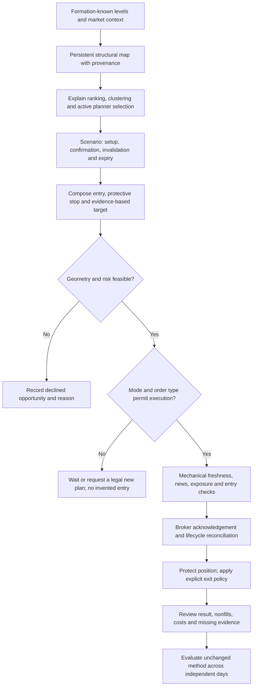

# Veteran audit — 09: the trading system, priorities and owner rulings

Owner: hoang. Review date: September 5, 2026. Continuation branch: `docs/vet-09-0905-complete`. Analysis and documentation only. This replaces the earlier section-09 synthesis; previous git revisions retain its history.

## One-page summary

**Verdict.** I see a level-based futures research system with a meaningful separation between planning, order handling and safeguards, but I cannot yet identify a demonstrated profitable trading method. The written plan offers more kinds of trade than the current strict execution path can express. The reward calculation can make a scenario mathematically admissible without establishing that the market offers that reward. Finally, historical policy changes and deficient measurements prevent attributing results to the current method. These are trading-design conclusions, not merely software bug counts. [A/B/T] Evidence is in sections 01, 03, 05, 07 and 08 and their requirement tables.

The dispatch-compliant sample is **58 trades in 12 CME session-days: corrected P&L −$466.43, 18 winners, 38 losers, two flats; wins excluding flats 18/56 = 32.1%, Wilson 95% [21.4%,45.2%]**. Recorded fees are zero, so this is not verified net-of-friction performance. There are no recorded fills after the supplied first enforced strict-mode boot. Historical losses do not prove the current strict book will lose; zero current-policy trades do not establish that it works. The reissued sections 01 and 06 supply exact IDs, exclusions, distributions and uncertainty. [T]

**Three biggest problems.**

1. **The description of the trade and the executable trade are not the same contract.** A directional label is not permission, a scenario without an executable entry is not an available trade, and a malformed stop is not working continuation exposure. I cannot evaluate a supposed fade/continuation strategy without first specifying what it could actually do. [A] Sections 03/05/07/08.
2. **Reward and invalidation are not consistently tied to the thesis.** A distant target can rescue a numerical R:R gate, while a displayed invalidation need not close a position. Those are distinct owner policy choices which the prose can obscure. The recorded arm-35/position-591 sequence is a concrete example, not proof that every early invalidation exit would improve P&L. [A/B] Sections 01/03/05.
3. **The research record cannot reliably distinguish a good market idea from selection and execution effects.** Duplicate touches, missing initial-risk/excursion provenance, incomplete historical state and correlated revisions obstruct causal claims. Calendar and volume features exist, but their existence does not validate a trading edge. [A] Sections 01/02/05/06/08; parent `2026-09-05-vet-09-complete-data/q01_context.json`.

**Three biggest opportunities.**

1. Define one eligible opportunity in plain language: market context, formation-known level, trigger, confirmation, permissible order, invalidation, stop, reachable structural target and expiry. Then count everything against that identity. [I]
2. Separate structural opportunity from the permission arithmetic: select a defensible target, compose a protective stop, and decline the scenario if the remaining reward cannot support its risk. Compare alternatives prospectively rather than fitting a preferred answer to old winners. [I]
3. Evaluate the whole decision chain on an unchanged policy with real fill/reference timestamps and complete costs. Keep operational correctness, incremental trading value and capital permission as three different acceptance decisions. [I]

I write in first person as the requested analytical perspective. I do not claim personal trading employment or a professional biography. [A] means inspected source/output; [B] is an inference; [T] is this book's measured data; [R] names external research and its transfer limits; [I] is an untested analytical judgment. Proposed changes below are recommendations only. No trading code, configuration, prompt, database, orders or runtime were modified. Disabled guardrails were a documented owner learning-mode choice (`2026-08-17-cto-final-verification.md:13`); the off switches are not themselves a software defect.

## 1. What the complete trading assessment must answer

### 1.1 What business is this bot actually in?

I would brief a risk manager with the executed and executable book, not with the number of scenarios the model can describe. Its historical book includes discretionary-model market entries which strict mode subsequently closed. The current architecture places plan arms at levels, uses composed stops and model-authored targets, and retains mechanical flat times. Fades and continuation triggers have different entry semantics; they cannot be pooled merely because they share a plan. Section 01's corrected condition/side/session/holding-time tables define the observed book. Section 03 defines the current authority map. **There is no current-strict realized cohort with which to claim profitability.** [A/T]

My untested design preference is one primary executable thesis per eligible opportunity, with a separate inactive alternative when the observable context changes. This is not a proposal to require one trade, force directional symmetry, or prevent multiple independent opportunities. It is a way to make a thesis falsifiable and its opportunity count stable. [I]

### 1.2 Where might an edge come from, and what has actually been proved?

A formation-known level might organize a rejection, a breakout, or neither. A hold/break label is an observation about price after a defined touch; it is not a trade return. Entry timing, fill probability, stop/target geometry, costs, expiry and alternative opportunities still determine economic value. Deduplicating timestamps cannot cure pre-formation scanning, and a confidence interval cannot cure it either. Section 02's definition/coverage table and section 01's ordinal/session/regime analyses must be read with their limits. Below the dispatch's n=30 cell threshold the ruling is **no verdict**; above it, dependence and data integrity still matter. [A/T/I]

I do not adopt RTH-L as a breakout prior or retire the six thinly sampled kinds. I do not infer that all long trades or all ASIA trades should be banned from the old sample. A useful result of this audit is knowing which claims remain unproved. The purpose of future clean collection is to choose among actual executable alternatives, not to decorate the same intuition with larger row counts. [I]

### 1.3 Do the entry, stop and target express the same trade?

The stop formula combines structural clearance with a volatility floor. That describes a protective envelope; it does not establish optimal initial risk. If a target is moved outward merely because the stop widened, the numerical ratio may improve while the opportunity did not. Conversely, mechanically tightening a stop to make the ratio pass changes the trade and can increase stopped-out winners. Neither adjustment is justified by algebra alone. [A/B/I] Section 01 reward analysis; section 05 initial-stop provenance and excursion limitations.

I would first identify the actual structural objective and invalidation, then check stop placement, worst permitted entry and remaining reward. If the geometry is infeasible, record a declined opportunity. The model can explain a target's basis, but should not receive credit for inventing sufficient distance. Structural, fixed-R and excursion-informed target designs should be compared on identical eligible opportunities with nonfills, costs and ordering ambiguity. I do not endorse a fitted MFE percentile for production from this dataset. [I]

**Measured target provenance changes the diagnosis:** **119/132 authored targets (90.2%, Wilson95 [83.9%,94.2%])** match a level in their own plan within one MNQ tick; **104/132 (78.8%, [71.1%,84.9%])** lie beyond a nearer directional plan level. These are repeated authored-arm observations, not independent trades. I do not conclude that the model fabricated the prices or intentionally gamed the gate. The outstanding trading question is whether the path through intervening structure earns enough additional payoff after costs. Same-document level membership is not proof of formation-known structural quality or attainability. [T/I] `2026-09-05-vet-01-way-it-trades.md:224`, `2026-09-05-vet-01-way-it-trades-complete-data/target_obstacles.csv:2`.

### 1.4 Does the system know when its method is inappropriate?

News and market context are not absent. The source renders a session calendar and computed trend/volatility context, gates Tier-1 windows, and attempts pre-news cancellation/flattening. The calendar producer refreshes live data and has a static fallback. That is existing implementation, not proof that every scheduled event was known and acted on at the time. [A] `trader/auto_trader_calendar.go:29`, `trader/auto_trader_session.go:124`, `trader/auto_trader_clock.go:678`; numbered excerpts in parent q01.

The regime label uses moving-average comparisons and daily ATR context. It is descriptive context; the label itself has not earned directional trading authority. Missing VIX and the not-yet-warmed realized-volatility baseline are explicitly represented as unavailable/warming in the source. [A] `kernel/regime.go:11`, `:49`, `:84`.

Volume is also present, but its resolution matters. The inspected profile assigns each one-minute bar's whole volume to its close-price bin across 120 bins; that is not a reconstruction of all transactions at price or aggressor-side order flow. [A] `kernel/levels_volume.go:159`, `:186`, `:193`. I would label it a bar-volume profile proxy and test whether it improves an executable decision. Adding more visually impressive market features without attribution would increase uncertainty. [I]

The trader question is therefore: **under which independently identifiable conditions does this particular entry/exit method work, fail, or become unmeasurable?** Section 06 covers news, roll, volatility and operational stop conditions; section 10 evaluates research-inspired alternatives with their transfer limits. A scheduled calendar cannot anticipate unscheduled news. No audit can promise that a blackout eliminates event risk. [I]

### 1.5 When the reason for entry fails, what happens?

Position 591 demonstrates the distinction between a thesis invalidation, a protective stop and an operational forced exit. Its broker protective stop was 29355 and its fill was 29355, so its broker-referenced stop slippage was zero. The old 3.37-point claim compares against a rewritten ledger stop and is not execution cost. A displayed invalidation appeared while the position remained open; the existing contract did not make that display an executable exit. [A] Section 05 Q1 and its raw NT8 witnesses.

I would define an invalidation-exit candidate separately from the existing emergency stop and scheduled flat. The candidate needs closed-bar timing, a price actually available after recognition, and a comparison including cases where the trade subsequently recovered. End-of-trade extrema cannot establish whether favorable movement came before adverse movement. A hindsight early exit on one loser is not a validated rule. [I]

### 1.6 Where should AI and the owner sit?

The model is useful as a structured hypothesis author and reviewer only to the extent its claims are measurable and legally executable. It should state context, why a level matters, confirmation, invalidation and alternatives. Mechanical code must own order syntax, position-plus-pending risk, clocks, legal entry types, stop protection and the final permission decision. An eloquent narrative is not independent evidence. [I] Sections 03 and 07 tie this proposed allocation to actual source boundaries.

I would place human judgment before the session in a short review of readiness, exceptional event context and the proposed playbook, with a session veto and existing emergency controls. That does not mean clicking approval on every trade or silently overriding a failed gate. It also does not mean the present UI already enforces such a workflow. The owner must choose that policy explicitly. [I]

### 1.7 Priority raised by the owner: what the planner loses when a level loses its seat

A level can remain a valid structural reference while being too far away, lower priority, redundant with another label, or unsuitable as a new entry. Those are different states. Losing a ranked seat does not itself prove invalidation. Conversely, keeping every historical line active forever would ignore formation, session roll, role changes and the level definition. I would make those distinctions explicit in the map and in the planner's view. [I]

The inspected implementation first applies a proximity band, grades candidates, collapses nearby clusters, gives priority/HTF/volume/side-balance seats, caps the result and finally sorts for display by distance. `ScoreLevelsMinGradeFull` first requests only twice the final seat cap from that already-capped scorer; its return named the pre-seat pool is not necessarily every detected graded level. [A] `kernel/levels_score.go:404`, `:420`, `:534`, `:563`, `:577`, `:601–615`.

The record is not sufficiently explanatory to validate this selection economically. Parent read-only `q02_planner_level_selection.json` lists **360 candidate rows: 179 seated and 181 cut; every cut is labelled max_levels:12, all component objects are empty, and all cut scores are zero**. These are census counts, not 360 independent opportunities. The writer assigns rank from the final seated array and derives a coarse cut reason after selection; once the cap is full, the record does not distinguish a lower score from grade or cluster effects. [A] `kernel/detector_recorder.go:35–97`, `trader/detector_record.go:83–93`. **A cut score of zero is missing scoring evidence, not proof of a worthless level.** Section 02 supplies the detailed question-by-question assessment.

I would audit one read at a time using only data available then: detected level and provenance → formation/session validity → score terms → each filter/collapse decision → final planner input → authored scenario/stop/target. For a removed level I would ask which role it could still serve: context, opposing barrier, target, invalidation anchor or executable setup. The relevant comparison is whether the filtered view leads to better executable decisions after costs than a predeclared structural/nearest-level baseline, including no-trades. Looking at a later reaction and declaring every omitted line a missed winner is not an objective test. [I]

My design proposal is a persistent, provenance-bearing structural map with an explicitly labelled active planner view and separate trade permission. A representative cluster should retain its member provenance. An omitted level should have an explainable status; a lower grade should not silently turn into “does not exist.” I would not tune weights or add seats solely to force today's chart to look right. That proposal remains documentation only. [I]

### 1.7A Capital economics and risk accounting

The corrected historical mean is **−$8.04 per trade**, with a whole-CME-day bootstrap 95% interval **[−$35.55,+$22.04]**, based on just **12 observed active days**. Leaving out any one day still leaves the mean negative, from **−$17.32 to −$1.25**. This does not demonstrate positive expectancy, and it is not an estimate of the untraded current strict policy. Adding hypothetical $4 round-trip friction shifts the historical mean to **−$12.04**; that is sensitivity arithmetic, not a quoted broker fee. [T] `2026-09-05-vet-06-risk-data/complete/evidence.txt:29`, `:38`, `:44`.

A trader must separate **research eligibility from account loss accounting**. The eligible sample excludes unattributable trades for strategy inference; actual account losses cannot disappear because their plan attribution is unresolved. The eligible August 20 block loses **$407.50**; restoring the separately identified unattributed position **539, −$84.50**, takes the source-shaped account sensitivity to **−$492**. This is not an exact historical active-account replay, but it demonstrates why a research-only filter must not be reused to claim the $450 account limit was never challenged. [A/T/I] `2026-09-05-vet-06-risk.md:125`, `2026-09-05-vet-06-risk-data/complete/context.json:1`.

The historical realized maximum drawdown is **$969**. Whole-day resampling at 100 trades gives **$2,806.79 p95 / $3,410 p99** drawdown, conditional on resampling this small mixed-policy history. These are stress illustrations, not live forecasts or a capital recommendation. Marked exposure, genuine live costs, gaps and owner capital are not fully observed. The proposed prospective qualification in section 06 requires **100 trades and 40 active days**, positive net lower confidence bounds and explicit drawdown/risk budgets. Those thresholds are untested governance choices [I], not statistically optimal parameters or a promise of qualification after forty days. [T/I] `2026-09-05-vet-06-risk.md:54`, `:99`, `:161`.

For arm 35, broker-linked risk/reward is **70/140.5 points**. Maintaining 2:1 permits at most **0.1667 points** of adverse entry displacement, below one MNQ tick. Therefore a generic four-tick continuation experiment must still fail a tighter setup-specific geometry check; the cap is never a blanket permission to chase. This particular example is a fade, not evidence of how an unobserved continuation would fill. [T/I] `2026-09-05-vet-05-execution.md:167`, `2026-09-05-vet-05-execution-data/complete/q35_complete.out:7`.

### 1.8 Review-only decision flow for the planner/executor contract

This diagram is the proposed audit/decision contract, not a claim that every box is already implemented. Sections 03 and 07 compare it with actual code and rendered prompts. Position protection/reconciliation must remain independent of discretionary model calls.

The actual executor-prompt audit must show its timestamped input, the selected plan revision and mode, whether an arm exists and is eligible, price freshness, accepted protection, pending exposure, news/session restrictions and the distinct meaning of a displayed invalidation. If a required fact is absent or stale, the report records that omission; it does not imagine the model knew it. The question is both **information sufficiency** and **authority consistency**, not merely shorter instructions. [I] Section 07's actual-prompt evidence and constraint/flow appendix are the detailed reference.

## 1A. External references and their actual scope

I use primary research to motivate testable questions, not to certify this bot. These references were checked directly through the issuing institution, authors' university pages or author-posted papers. Scope and transfer limits are part of each citation; detailed section-level analysis follows in sections 02 and 10.

| Reference | What it studies | Relevance and limit for this audit |
|---|---|---|
| [Osler, Currency Orders and Exchange-Rate Dynamics, New York Fed Staff Report 125 (2001; published 2003)](https://www.newyorkfed.org/research/staff_reports/sr125.html) | Stop-loss and take-profit order clustering at a large foreign-exchange dealer. | [R] A mechanism for both reversal near a level and acceleration through it. It does not establish which NOFX level kind or touch ordinal has positive net MNQ expectancy. |
| [Gao, Han, Li and Zhou, Market Intraday Momentum (2018)](https://profiles.wustl.edu/en/publications/market-intraday-momentum/) | First-half-hour versus last-half-hour returns using S&P 500 ETF data and additional ETFs; published in Journal of Financial Economics 129(2), 394–414. | [R] Motivates a precisely timed context hypothesis. It is not evidence to buy any intraday pullback or bypass the bot's 14:45 flat rule; the studied window and instrument differ. |
| [Moskowitz, Ooi and Pedersen, Time Series Momentum (2012), published paper](https://fairmodel.econ.yale.edu/ec439/mosk.pdf) | Futures across asset classes, with persistence at one-to-twelve-month horizons. | [R] Motivates distinguishing a trend strategy from a fade and evaluating risk scaling. Its horizon and diversified portfolio cannot validate a five-minute MNQ direction rule or two-contract promotion. |
| [Zarattini and Aziz, Can Day Trading Really Be Profitable? (2023, author-posted revision)](https://papers.ssrn.com/sol3/papers.cfm?abstract_id=4416622) | An opening-range approach evaluated using QQQ/TQQQ and leverage assumptions. | [R] A reproducible candidate to examine, not direct evidence for this bot's resting levels, stop floor or continuous futures fills. Headline paper returns are not imported into the audit. |
| [Zarattini, Barbon and Aziz, A Profitable Day Trading Strategy for the U.S. Equity Market, SFI paper 24-98](https://www.alexandria.unisg.ch/server/api/core/bitstreams/3c2989c4-688d-4d78-8a71-f02690990d51/content) | Opening-range trading and selection of unusually active individual equities. | [R] Motivates measuring volume/context selection. Selecting stocks from a universe is different from trading a single index future; the stock-selection effect is not an MNQ filter already proved. |
| [Lo, The Adaptive Markets Hypothesis (2004), published paper](https://web.mit.edu/Alo/www/Papers/JPM2004_Pub.pdf) | An evolutionary framework for changing market efficiency. | [R] Supports treating efficacy as conditional and potentially changing. It supplies no calibrated monthly kill threshold or particular profitable entry rule. |

For volume profile, the exact implemented transformation is evidenced in `kernel/levels_volume.go:159–206`, including assigning bar volume to the close bin. That source establishes the calculation. I do not cite a trading manual or the mere popularity of POC/VAH/VAL as proof that this proxy yields an edge. [A/I]

## 2. Ten priorities — proposals, not implementation

Each priority names what I would change in a future authorized project, why, what it takes and the number I would watch. Engineering defects constrain the experiment, but they do not substitute for the trading thesis.

| Priority | What and why | What it takes | Number or evidence to watch |
|---|---|---|---|
| 1. Preserve structure and define the executable setup | Keep a provenance-bearing structural map distinct from ranked active levels and trade permission. Separate rejection and continuation hypotheses, observable context and a stable opportunity identity. Losing a seat is not invalidation; the narrative and order-capable book diverge. [A/I] §§1.1–1.2/1.7; sections 01/02/03/08. | Owner playbook ruling, data contract; later prompt/code if authorized. | Unique eligible opportunities, actual sends/fills/nonfills and corrected returns by unchanged policy and independent day; no verdict for thin cells. |
| 2. Remove target stretching to pass a ratio | Choose a defensible target before permission arithmetic; retain placement/change revalidation. [A/B/I] §1.3; sections 01/03. | Owner target-ownership ruling and data-first comparison. | Target reach before stop, net expectancy, declined infeasible geometry and revisions per unchanged thesis. |
| 3. Make the intended entry a real order | Correct the stop trigger argument and stop-side predicate before judging continuation fillability. [A] Section 05 source/log trace. | Separate code/C# deployment project and broker-observed SIM acceptance. | Zero wrong-type/price/side acknowledgements; explicit rejected/cancelled/filled outcomes by intent. |
| 4. Bound combined contingent exposure | Count open positions and all potentially fillable entries, including pending cancellations. A per-ticket clamp is insufficient. [A/I] Section 05; earlier snapshots 1604/1608/1688/1689. | Broker reconciliation and owner exposure contract, then code. | Maximum possible filled-plus-pending entry exposure and unprotected filled quantity, not just ticket quantity. |
| 5. Define the thesis exit separately | Compare a precisely timed invalidation exit with stop/target/EOD; do not claim a time stop is already beneficial. [A/I] §1.5; section 05. | Owner exit-policy ruling, ordered-path data, shadow experiment. | Incremental net return including recoveries, exit latency, unresolved ordering and missing stop provenance. |
| 6. Test context instead of trusting labels | Treat regime/session/news/volume as candidate conditioning information, not automatic direction or new bans. [A/I] §1.4; sections 02/06/10. | Data first, predeclared context definitions and loss budget. | Independent days per cell, incremental net performance, missing calendar/context and policy stability. |
| 7. Repair the research record before tuning | Stop treating duplicated touches, mutable risk or missing excursions as independent evidence. Preserve legacy data; do not rewrite trading history. [A] Sections 01/02/05/06. | Separate instrumentation/data project after owner authorization. | Formation violations, duplicate identities, missing initial risk, fees, excursions and exact execution joins. |
| 8. Make readiness and loss controls truthful | Show live feed/order ages, broker protection and enabled limits; verify the deployed behavior separately from dev code. Reuse existing alert channels. [A/I] Sections 04/06. | Owner risk-response policy; later monitor/UI/wiring work. | Unknown/stale exposure duration, trip-to-cancel acknowledgement, actual open risk and review completeness. |
| 9. Remove contradictory model authority | Remove impossible strict-mode opens, unsupported market percentages and the unneeded three-levels-per-side prompt quota; distinguish conditional shadow FVG research from live permission and simplify instructions without covert policy changes. [A/I] Section 07. | Review-only rewritten appendix now; any application is a later authorized prompt change. | Constraint coverage, token count, invalid suggestions and repeated same-rule failures per actual read. |
| 10. Run one prospective method test | Freeze one primary hypothesis and compare executable variants on shared opportunities, with friction and independent-day uncertainty. A calendar deadline cannot guarantee an answer. [I] Sections 06/10. | Owner experiment and risk-budget ruling; operational and measurement gates first. | Net expectancy lower bound, independent days, drawdown, friction sensitivity and lifecycle breaches. |

## 3. Owner rulings — all deferred

The original dispatch asks for yes/no questions and my recommendations. This is that page; the user has not authorized implementation. My answer is a recommendation for a later decision, not an applied setting. All untested policy preferences are [I].

| Yes/no decision | My recommendation | Reason |
|---|---|---|
| Keep SIM and one contract while validating the method? | Yes | No current-policy edge or full execution acceptance supports promotion. |
| Define separate observable eligibility for fades and continuation plays? | Yes | Their entry semantics and economic hypotheses differ. |
| Preserve structurally meaningful levels independently of whether they win an active planner seat? | Yes | Source and candidate 195 show selection can remove a reference without recorded invalidation. Keep full provenance and distinct active/tradable states. |
| Change the live grade weights or level cap based on the one-day comparison? | No | Matched 34 pairs share one day and cannot establish economic superiority. |
| Force a trade because either directional label says long or short? | No | A contextual label has not earned entry authority. |
| Force equal numbers of long and short scenarios/trades? | No | Symmetric capability is different from forced exposure. |
| Assign the model unrestricted control over risk size? | No | Risk must remain mechanically bounded. |
| Choose structural targets first and reject infeasible geometry? | Yes | Passing R:R is not evidence the target is reachable. |
| Replace authored targets directly with a fitted MFE percentile now? | No | Ordered paths and initial-risk provenance are inadequate. |
| Compare structural, fixed-R and MFE-informed targets prospectively? | Yes | This can test actual economic alternatives under shared signals. |
| Remove the mechanical R:R check after plan creation? | No | Entry price and stop geometry can change. |
| Enable bounded marketable entry immediately? | No | Correct order semantics and fill-quality evidence come first. |
| Evaluate four ticks as a shadow cap alongside alternatives? | Yes, experimental | It is an uncalibrated candidate, not a promise of execution or an edge. |
| Retire eVWAP, VWAP±2σ, EQL, ONH, ONL and PDL on current touch results? | No | Thin, duplicated and formation-leaking observations cannot justify retirement. |
| Flip RTH-L automatically from fade to break? | No | Its apparent sample size is not independent evidence. |
| Remove the entire conditional FVG authoring block solely because its orders are shadowed? | No | Section 07 verifies an empty-list abstention branch and intentional shadow authoring/scoring. Clarify its research status; deleting it is a separate research-policy change, not prompt compression. |
| Replace the Rules paragraph with a shorter numbered appendix? | Yes | Apply only after semantic coverage and any policy changes are separately reviewed. |
| Add a 14:45–16:30 CT blackout for nonessential planner wakes? | Yes, policy proposal | Preserve risk/reconciliation work and the scheduled 16:30 read. |
| Change the 14:45 flat time based on the three-day stretch? | No | One hindsight continuation is insufficient evidence. |
| Make acceptance/hold armable immediately? | No | First define confirmation timing and valid order semantics, then shadow-test. |
| Add a thesis-invalidation exit directly to production? | No | Compare a precise candidate against recoveries and the current baseline first. |
| Retain a protective stop while evaluating alternative exits? | Yes | A thesis rule is not a substitute for emergency protection. |
| Enforce one-contract exposure across positions and fillable pending entries? | Yes | Per-ticket clamping does not control combined exposure. |
| Verify daily-loss behavior and enabled settings before relying on a configured number? | Yes | Source, running revision and switches are separate facts. |
| Make a loss trip cancel entries and persist across restart? | Yes, policy proposal | Blocking future analysis alone leaves contingent risk. |
| Treat the daily dollar threshold as a guaranteed worst loss? | No | Gaps, fills and already-open exposure can overshoot. |
| Add a trade-count cap? | No | The existing owner ruling stands. |
| Approve any precise per-trade/weekly budget as statistically optimal? | No | Proposed budgets are owner risk preferences, not established optima. |
| Increase to two contracts to allow scaling out? | No | Splitting exits does not supply evidence for increased exposure. |
| Ban ASIA or all longs solely from the mixed historical sample? | No | The subgroup/policy evidence is inadequate. |
| Add new external alert channels? | No | The owner's declined-channel ruling stands; assess existing surfaces. |
| Add a pre-session owner review and veto? | Yes, policy proposal | It makes operating exceptions and human authority explicit. |
| Treat a one-month inconclusive result as proof that the method cannot work? | No | Insufficient evidence and measured failure are different outcomes. |

Technical references checked for this synthesis: [CME MNQ contract specification](https://www.cmegroup.com/markets/equities/nasdaq/micro-e-mini-nasdaq-100.html) gives $2 per index point and a 0.25-point tick. Four ticks therefore equal one point, or $2 per contract of entry displacement before other costs. That arithmetic does not establish an optimal cap. [NinjaTrader CreateOrder reference](https://ninjatrader-staging.ninjatrader.com/support/helpguides/nt8/createorder.htm) has separate limit-price and stop-price arguments; the observed source-slot defect is a contract issue, not a market hypothesis.

## 4. Cross-report reconciliation and checklist cross-check

The following rulings control how the ten reports may be read together. Prior report/data revisions remain historical provenance, not simultaneous competing recommendations. The renewed complete reports supersede their earlier conclusions. “Unknown” is retained where original decision-time evidence cannot be recovered.

| Apparent conflict or old premise | Reconciled ruling and evidence |
|---|---|
| 65 versus58 trades; old dependent returns | Primary **58 / −$466.428572 / 18W38L2F / 12 CME days** throughout. Exclude sentinel plan IDs 530,539,545,546,566,571,580, test 572–574 and NULL 576,577,579. Exact included IDs and independently recomputed tables: sections01/05/06/07/08/10 complete datasets. The exclusions belong to research, not concealment of actual account loss. |
| Slightly different day-bootstrap intervals | Section 06's 100,000-draw result **[−$35.55,+$22.04]** is the synthesis reference. Sections 01 and 10 use 20,000 draws with different declared seeds and report approximately **[−$35.33,+$21.33]** and **[−$35.62,+$21.82]**. This finite-resampling variation does not change the no-demonstrated-edge ruling; none is a current-strict forecast. Naive iid intervals are separately labelled. |
| Initial R unavailable versus nine measured rows | Section 01 establishes exact initial broker-stop lineage for **568,570,575,578,582,584,585,586,591**; the remaining 49 lack a defensible denominator. Sections 05/06 correctly deny a complete58-row initial-R distribution. Nine selected records do not repair missing excursions or establish cell-level edge. Section 01 Q1 and `broker_R.csv:2`. |
| Stored zero MAE means no adverse movement | Winner 569/584 zero values are uncertain under the historical writer. The parent/section01 sensitivity excludes them without changing primary P&L. Sixteen remaining winner proxies have MAE p50/p80/p95 **13/22.5/48.1875**. This is still not a coverage-verified path sample. Section 05 Q5, parent `q03_proxy_sensitivity.json:1`. |
| The target is fabricated / targets are already structural | **119/132** match their own plan map, but **104/132** pass a nearer map level. Proximity or matching a label is not economic validation. The question is target-path value after costs, not an unproved accusation of author intent. Section 01 Q4. |
| Funnel 22 versus 188 opportunities | Section 05 uses distinct **(plan_id,scenario) families** with enabled arms and plan dates Sep 2–4:22→7→4→2 range-reach proxies→1fill→0wins. Section 08 uses **scenario-version ideas whose windows overlap the wall-clock stretch**, including carry-in: 188. They answer different questions and must not be combined into one conversion. Both de-duplicate retries inside their declared unit; neither counts independent market opportunities by merely adding revisions. |
| Plan-version counts 94 versus 95 | Section 03 filters intraday session plans; Section 07 includes all session types. Exactly one WEEKLY row, plans.rowid 223, accounts for 95−1=94. Neither is an attempted-model-call denominator. |
| Stop cluster 20 versus 21 | Section 03 counts later placement sequences 1–20; arm 38 is the initial attempt. Sections 05/08 include it for 21 total signal-bearing attempts. Stored stop/condition fields differ, so these are one repeated scenario family, not byte-identical tickets. |
| 21 stop submissions | One repeated Sep 4 NY v3 S2 idea, with zero stop-price payload. Attempts are not 21 independent setups; signal presence is not acceptance/fill. Sections05/08 corroborate the two source defects with broker records. |
| 3.37-point stop slippage | Position 591 broker accepted 29355 and filled 29355: **0 broker-stop slippage**. 3.37-points compare mutable ledger geometry with the broker. No live-slippage distribution follows. Sections04/05/08. |
| Cancelled arm 33 over 1.7 points | Logged decision price establishes **0.70 points**;1.70 comes from the containing bar's later extreme. An adverse-entry cap must use an available execution reference, not retrospective candle penetration. Section 05 Q3. |
| Four-tick cap “right” or “wrong” from touch penetration | Four ticks is an **untested experimental candidate**, not the calibrated answer. The prior revision's touch-penetration distribution is not an executable entry-quote/cost distribution either. Preserve cancellation as current recommendation, compare caps under a specified order type and setup-specific geometry. Arm 35 cannot tolerate even one adverse tick while preserving 2R. |
| No alert versus outage detection | In-app critical feed alert exists; owner attention is not proved. Process silence, disconnected broker and stale bars are separate clocks. Current source inventory is not an observed desktop inspection. Sections04/08. |
| Outage 113.86 versus 114.85 minutes; recovery 48.3 versus 50.45 minutes | Section 04 uses DB log_events 25754 at 12:24:33 →25755 at 14:18:24; Section 08 uses retained file last-line 12:23:33 →startup 14:18:24. First ingest 15:06:45 differs from first recovered decision 15:08:51. Different evidence streams/endpoints explain the values; neither proves exact host-down duration or owner attention. |
| No calendar / no volume | Both exist. Calendar refresh/fallback and Tier-1 order-handling behavior are source-verified; historical receipt/reaction is incomplete. Profile is minute-volume assigned to close bins, not transaction volume-at-price. Sections02/06/10 and parent q01. |
| FVG block universally impossible or dead | Section 07 verifies its conditional empty-list abstention and intentional shadow authoring/scoring. Do not delete it as if it were redundant text. Any removal is a separate research-policy choice; the compression appendix preserves it. |
| Short prompt is behaviorally equivalent | Section 07 delivers 28 numbered lines, 120 mapped constraints and 4,888→2,414fallback-token counts. Constraint coverage is checked; stochastic behavior, validator acceptance and economic improvement are **unmeasured**. It deliberately preserves current contradictions; proposed policy corrections are separate. |
| Daily-loss off is a new defect | Historical owner documentation identifies a deliberate learning-mode choice. Fresh flags remain off; deployed revision and dev wiring differ. Entry blocking is not flattening and a configured dollar figure is not a guaranteed loss cap. Sections 05/06/07. |
| One month / 30 trades versus 100 trades and 40 days | Section 05's 30 closes check is instrumentation; section 10's n30/D20 gate concerns a next SIM research stage; section 06's n100/D40 and risk budgets concern a proposed live qualification. All are declared untested governance thresholds, not competing estimates of the trade count proving an edge. A month can be inconclusive. |
| Exact three-day replay profit | Withdrawn. Section 08 executes source-based local necessary conditions and finds 4 conditional independent price reaches, 3 on a cadence sensitivity; it does not infer portfolio fills or point P&L. Exact counterfactual broker state, order sequence and costs are missing. |

I cross-checked the proposed work against the checklist and inspected sources. These shipped items must not be rebuilt as new findings:

| Existing behavior / fix | Source evidence | Remaining audit question |
|---|---|---|
| Snapshot-based reaper, class 79 | `trader/armed_executor.go:1072`, `trader/reaper_snapshot.go:51`; section 08 observed stale-cancel predicate replay | Deployed observation and recovery correctness, not a new silence-timeout design |
| Working-arm overwrite protection | `store/armed_orders.go:201`; change 3b8d6cd6; section 05 Q1 | Verify immutable initial accepted prices for measurement; retain earlier incident as history |
| Excursion hooks and unknown-not-zero path | `trader/auto_trader_clock.go:752–772`; changes 44d4bbb7/d4aee04a | New-policy complete linked observations; an empty historical table is not proof no writer exists |
| Entry invalidation callback | `trader/entry_gate.go:229`; checklist class59; section 07 flow | An entry veto and a position thesis exit differ; unavailable callback state remains separately visible |
| Derived reclaim schema and general resolved floor | `kernel/arm_kind.go:89`, `kernel/planner_prompt.go:733` | Remaining waterfall 1.0 literal, legal repair route and exact prompt at future read; no duplicate schema-list patch |
| News entry cancellations even while flat | `trader/auto_trader_clock.go:678` | Known event freshness, correct date/window, acknowledgments and operator attention |
| Daily trip wiring on dev | `kernel/engine_analysis.go:183`, `trader/entry_gate.go:169`, `kernel/risk_limits.go:164` | Running-revision difference, effective switches, response policy and measured latency; no deployment here |
| Stage A one-lot clamp / owner qualification policy | `kernel/risk_limits.go:373`; checklist:646 | Clamp does not compute n or CI; no statistical counter exists to reset |

PART 2's evidence, independent arithmetic, corrected-P&L and isolation requirements and PART 3's custody/deployment safeguards are reviewed explicitly in Section 07 Q5. This documentation task does not exercise deployment steps or broker drills. The persistent source base and differing running revision are documented so audit publication cannot be mistaken for a runtime update.

## 5. Original-dispatch coverage and completion evidence

The [coverage index](2026-09-05-vet-audit-index.md) maps 47 numbered request groups to question-level answers. Each section further maps subparts to measured results, proposals and exact missing inputs. Every report begins with its verdict, three problems and three opportunities and ends with ranked what/why/category/metric recommendations. Report presence alone is not treated as completion.

**Completed audit receipt.** On September 5 at 18:18 CT, I verified every final source report (01–08 and 10) directly from dev **`8aebb727f13920c541afe6704e977de49f375dbe`** against the reviewed files. Their byte lengths and SHA256 values are in [`publication-receipt.json`](2026-09-05-vet-09-complete-data/publication-receipt.json). This satisfies the original section 09 requirement to reconcile the reports on dev, rather than only their drafts.

The independent packet check reconciled six population exports to the same 58 IDs, corrected P&L and 18W/38L/2F, verified all 47 question-heading references and ten coverage tables, checked local Markdown targets, and verified the entire change from the original synthesis base remains under `docs/superpowers/reports/`. Credential-shaped checks included compressed evidence inputs. [`final-validation.json`](2026-09-05-vet-09-complete-data/final-validation.json) records the content-check snapshot before this final receipt; it is not a self-referential hash of this later receipt paragraph.

The final read-only health check returned **HTTP 200**, with runtime revision **`36648655cfe0`**. A healthy HTTP response is not proof of feed freshness, broker protection or profitable operation. Runtime remains distinct from the audit dev revision. No deployment or broker action was performed.

The [Vietnamese owner guide and 47-question index](2026-09-05-vet-audit-index.md) is the delivery entry point. This audit is complete as an evidence-bounded assessment. Current-strict expectancy, complete initial-risk/excursion coverage, full historical broker replay and the profitability/behavioral effect of the proposed changes remain explicitly unmeasured. Every proposed implementation remains unapplied.
